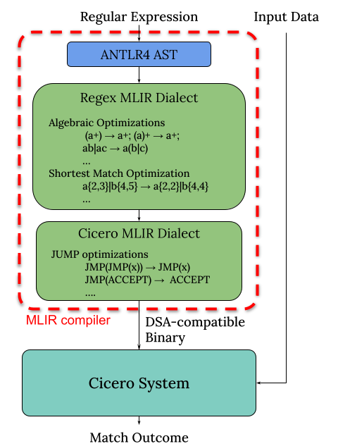
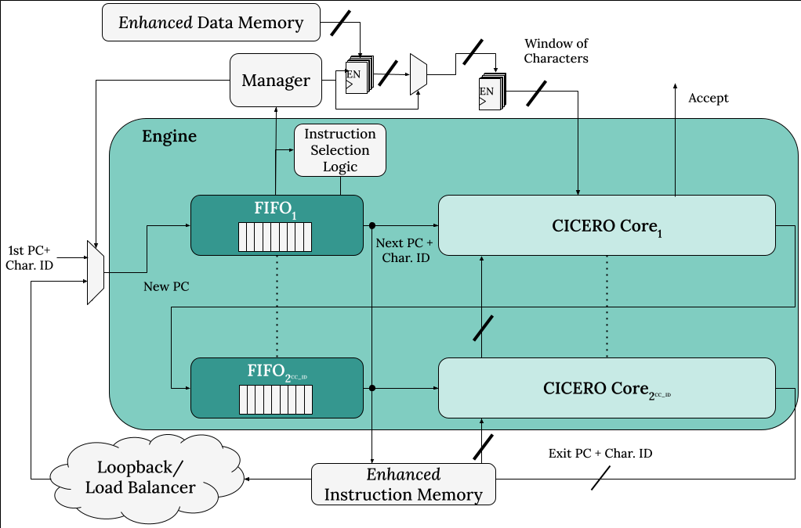

# CICERO: A Domain-Specific Architecture for Efficient Regular Expression Matching [](https://doi.org/10.5281/zenodo.13340217)
Code regarding Parravicini et al. 2021 paper can be found [here](https://github.com/necst/cicero/releases/tag/CASES21), and the old readme [here](https://github.com/necst/cicero/blob/feature/cgo25/CASES.md)

Cicero is a domain specific architecture that can be employed to perform exact regular expression (RE) matching using FPGAs.
The cool fact about Cicero is that - as other software libraries one among the other [RE2](https://github.com/google/re2) - does not suffer from backtracking problem.
This means that when it elaborate a REs that carry some kind of non-determinsm (e.,g. a?a ) it does not take a guess and then backtrack but can explore all the different options in a single pass of the input string.

If you are interested in the topic take a look at [Russ Cox article](https://swtch.com/~rsc/regexp/regexp1.html).

## System View



From a system perspective, Cicero features two components:

1. **A compiler**: which compiles REs into a domain specific ISA binary
2. **An architecture on FPGA**: which receives a compiled RE and an input string, and output wheter the input is matched by the RE or not.

## Compiler Overview

The compiler's code can be found [here](https://github.com/necst/cicero_compiler_cpp). The compiler is implemented using MLIR and ANTLR4. The compilation pipeline can be described as follows:

1. Parse textual RE into ANTLR4 AST
2. Generate representation of Regex using the proposed `regex` MLIR dialect
3. (optional) Optimization pass on `regex` dialect
4. Lowering conversion of `regex` dialect to proposed `cicero` dialect
5. (optional) Optimization pass on `cicero` dialect
6. Generate Cicero ISA binary code

## Architecture Overview



The Cicero architecture features a sliding window of input characters. Each character in the window is addressed by a `CC_ID_BITS`-bits wide pointer, as such the window contains `2^CC_ID_BITS` characters.
The Cicero architecture is composed of multiple *engines*, which can be combined together in ring or torus topologies. Execution threads are distributed among engines by a load balancing infrastructure. However, during our studies we found out that an architecture configuration with a single engine is more efficient.
Each engine packs as many FIFOs and CICERO-cores as number of characters in the input window.

## Code Overview

- `bitstream`: pre-compiled bitstreams for Ultra96 v2 board, and their static metrics (board usage percentages and total on-chip power)
- `cicero_compiler`: older compiler implementation
- `cicero_compiler_cpp`: new compiler implementation, using MLIR
- `hdl_src`: System Verilog implementation of the architecture
- `proj`: Vivado project files for the architecture development
- `scripts`: Various helper scripts for development, verification and benchmarking

## Development

See [development.md](./development.md)

## Acknowledgment

This work has financial support from ICSC – Centro Nazionale di Ricerca in High Performance Computing, Big Data and Quantum Computing, funded by European Union – NextGenerationEU.
The authors are grateful to the CGO 2025's anonymous reviewer feedback, the AMD University Program support, and [Valentina Sona](https://github.com/ValentinaSona) for working on the [original Cicero architecture simulator](https://github.com/necst/SoftwareCICERO/).

## Paper Citation

If you find this repository useful, please use the following citations:

```
@inproceedings{somaini2025cicero,
    title = {Combining MLIR Dialects with Domain-Specific Architecture for Efficient Regular Expression Matching},
    author = {Andrea Somaini and Filippo Carloni and Giovanni Agosta and Marco D. Santambrogio and Davide Conficconi},
    year = 2025,
    month = {mar},
    booktitle={2025 IEEE/ACM International Symposium on Code Generation and Optimization (CGO)}
 } 
```

```
@article{parravicini2021cicero,
    title = {{CICERO}: A Domain-Specific Architecture for Efficient Regular Expression Matching},
    author = {Daniele Parravicini and Davide Conficconi and Emanuele Del Sozzo and Christian Pilato and Marco D. Santambrogio}, 
    journal = {{ACM} Transactions on Embedded Computing Systems},
    year = 2021,
    month = {oct},
    publisher = {Association for Computing Machinery ({ACM})},
    volume = {20},
    number = {5s},
    pages = {1--24},
    doi = {10.1145/3476982},
    url = {https://doi.org/10.1145%2F3476982},
 } 
```
